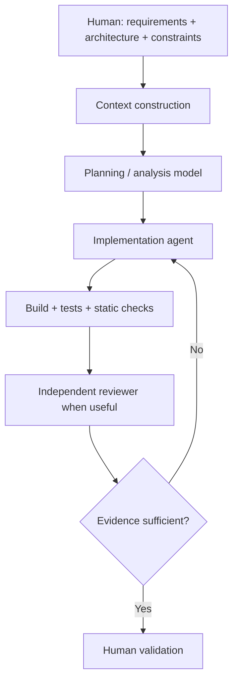

# EDITH Aegis — AI Engineering & Model Lab

**Valutazione LLM · coding agent · context engineering · workflow multi-model**

[**English**](README.md) · **Italiano**

Questa è un'edizione pubblica curata della ricerca di **EDITH Aegis**, focalizzata sul lavoro di AI/software engineering sviluppato all'interno del progetto privato.

> Esclusi per scelta: target reali di sicurezza, dettagli di vulnerabilità, credenziali, evidenze private, dati operativi dei programmi e materiale di security research non necessario per dimostrare la metodologia ingegneristica.

## Idea centrale

Il progetto tratta gli LLM come componenti ingegneristici con capacità, costi e modalità di fallimento differenti.

L'obiettivo non è:

> "dare il progetto a un'AI e accettare quello che scrive."

L'obiettivo è:

> definire il problema, costruire il contesto corretto, instradare il task verso il modello appropriato, limitarne il perimetro, verificarne il risultato e usare una revisione indipendente quando il rischio lo giustifica.

## Model Lab — esercizio reale di selezione

Aegis contiene un vero workflow di selezione modelli per ruoli locali/self-hosted di ricerca.

Snapshot sorgente:

```text
Commit repository privata:
54f47d1c6c53e2c57c0f3ee29f33fc0b61a77891
```

L'assegnazione congelata dei ruoli era:

| Ruolo | Modello selezionato |
|---|---|
| FAST_ANALYST | `gpt-oss:20b` |
| DEEP_CODE_ANALYST | `qwen3:14b` |
| RESEARCH_CRITIC | `qwen3.6:27b-coding` |
| SECOND_OPINION | `qwen3.8:27b` |

Il ruolo critic ha ricevuto un holdout congelato aggiuntivo perché il benchmark iniziale era troppo vicino per una decisione affidabile.

Sul critic holdout da 12 casi:

| Metrica | qwen3.6:27b-coding | gemma4:26b |
|---|---:|---:|
| Verdict corretti | 12/12 | 12/12 |
| Falsi positivi | 0 | 0 |
| Falsi negativi | 0 | 0 |
| Precision evidenze | 1.0000 | 1.0000 |
| Recall evidenze | **0.9722** | 0.8889 |
| Qualità media | **99.375** | 97.500 |
| Latenza media | 19.41 s | **5.65 s** |

I criteri di selezione erano stati definiti prima dell'esecuzione dell'holdout. È stato selezionato il modello più lento perché soddisfaceva il gate di recall delle evidenze, mentre il finalista più veloce no.

Il benchmark ha inoltre individuato un problema nel **proprio scorer**: un controllo naive per substring su claim vietati penalizzava risposte critic corrette che stavano esplicitamente rifiutando un claim. Lo scorer è stato corretto e gli output esistenti sono stati ricalcolati senza rieseguire l'inference.

Questa correzione è parte importante del lavoro: anche l'infrastruttura di valutazione deve essere considerata fallibile e testabile.

Vedi [Model Lab case study](docs/MODEL_LAB_CASE_STUDY.md).

## AI-assisted software engineering

Un workflow tipico è:



## Competenze rappresentate

- valutazione dei modelli specifica per task
- model routing
- context engineering
- lavoro delimitato con coding agent
- handoff strutturati tra sessioni/modelli
- separazione implementazione/revisione
- criteri di accettazione
- evidenze tramite test/build
- provenance e auditabilità
- confini deterministici attorno a output non deterministici

## Routing nello sviluppo

Il progetto privato mantiene anche regole di routing esplicite per il lavoro di sviluppo.

Esempi:

- implementazione ordinaria → modello coding rapido e capace
- debugging cross-cutting difficile → modalità con maggiore reasoning
- review architetturale/policy → modello orientato al reasoning
- review indipendente ad alto valore → famiglia di modello differente quando giustificato

La regola è **escalare intenzionalmente**, non usare semplicemente il modello più costoso per ogni task.

## Regole ingegneristiche

Regole rappresentative:

- ispezionare prima di modificare
- definire lo scope prima dell'implementazione
- preferire la più piccola vertical slice testabile
- mantenere deterministica la logica che può esserlo
- non inventare risultati di benchmark o test
- aggiungere/modificare test quando cambia il comportamento
- verificare prima di dichiarare il completamento
- riportare esplicitamente l'incertezza residua
- considerare l'output del modello advisory, non automaticamente autorevole

## Documentazione

- [Model Lab case study](docs/MODEL_LAB_CASE_STUDY.md)
- [LLM evaluation methodology](docs/LLM_EVALUATION.md)
- [Coding-agent workflow](docs/AGENTIC_WORKFLOW.md)
- [Structured handoff template](examples/STRUCTURED_HANDOFF.md)
- [Evaluation template](examples/MODEL_EVALUATION_TEMPLATE.md)
- [Source provenance](docs/SOURCE_PROVENANCE.md)
- [Public scope](docs/PUBLIC_SCOPE.md)

## Link

- Engineering portfolio: https://github.com/Aceishere66/engineering-portfolio
- EDITH Dev Studio engineering page: https://edithdevstudio.com/engineering
