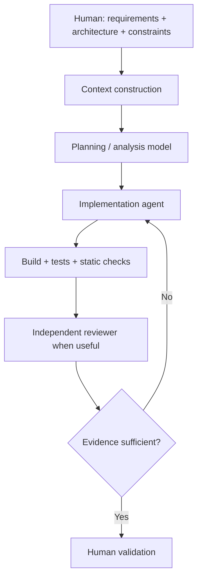

# EDITH Aegis — AI Engineering & Model Lab

**LLM evaluation · coding agents · context engineering · multi-model workflows**

This is a curated public research edition of **EDITH Aegis** focused on the AI/software-engineering work developed inside the private project.

> Excluded by design: real security targets, vulnerability details, credentials, private evidence, operational program data and security-research material that is not needed to demonstrate the engineering methodology.

## Core idea

The project treats LLMs as engineering components with different capabilities, costs and failure modes.

The objective is not:

> "give the project to an AI and accept what it writes."

The objective is:

> define the problem, construct the right context, route the task to an appropriate model, constrain the work, verify the result, and use independent review when the risk justifies it.

## Model Lab — real selection exercise

Aegis contains a real model-selection workflow for local/self-hosted research roles.

Source evidence snapshot:

```text
Private repository commit:
54f47d1c6c53e2c57c0f3ee29f33fc0b61a77891
```

The frozen role assignment was:

| Role | Selected model |
|---|---|
| FAST_ANALYST | `gpt-oss:20b` |
| DEEP_CODE_ANALYST | `qwen3:14b` |
| RESEARCH_CRITIC | `qwen3.6:27b-coding` |
| SECOND_OPINION | `qwen3.8:27b` |

The critic role received an additional frozen holdout because the initial benchmark was too close to call.

On the 12-case critic holdout:

| Metric | qwen3.6:27b-coding | gemma4:26b |
|---|---:|---:|
| Correct verdicts | 12/12 | 12/12 |
| False positives | 0 | 0 |
| False negatives | 0 | 0 |
| Evidence precision | 1.0000 | 1.0000 |
| Evidence recall | **0.9722** | 0.8889 |
| Mean quality | **99.375** | 97.500 |
| Mean latency | 19.41 s | **5.65 s** |

The selection criteria were precommitted before the holdout was run. The slower model was selected because it met the evidence-recall gate while the faster finalist did not.

The benchmark also caught a flaw in its **own scorer**: a naive forbidden-claim substring check incorrectly penalized critic responses that explicitly rejected a claim. The scorer was corrected and existing outputs were rescored without rerunning inference.

That correction is important to the engineering story: evaluation infrastructure itself must be treated as fallible and testable.

See [Model Lab case study](docs/MODEL_LAB_CASE_STUDY.md).

## AI-assisted software engineering

A typical development workflow is:



## Skills represented

- task-specific model evaluation
- model routing
- context engineering
- bounded coding-agent work
- structured handoffs between sessions/models
- implementation/review separation
- acceptance criteria
- test/build evidence
- provenance and auditability
- deterministic boundaries around non-deterministic model output

## Development routing

The private project also maintains explicit routing rules for development work.

Examples:

- routine implementation → capable fast coding model
- difficult cross-cutting debugging → higher-reasoning mode
- architecture/policy review → reasoning-focused model
- high-value independent review → different model family when justified

The rule is to **escalate intentionally**, not simply use the most expensive model for every task.

## Engineering rules

Representative rules include:

- inspect before editing
- define scope before implementation
- prefer the smallest testable vertical slice
- keep deterministic logic deterministic
- do not fabricate benchmark or test results
- add/modify tests with behavior
- verify before claiming completion
- report remaining uncertainty explicitly
- treat model output as advisory, not automatically authoritative

## Documentation

- [Model Lab case study](docs/MODEL_LAB_CASE_STUDY.md)
- [LLM evaluation methodology](docs/LLM_EVALUATION.md)
- [Coding-agent workflow](docs/AGENTIC_WORKFLOW.md)
- [Structured handoff template](examples/STRUCTURED_HANDOFF.md)
- [Evaluation template](examples/MODEL_EVALUATION_TEMPLATE.md)
- [Source provenance](docs/SOURCE_PROVENANCE.md)
- [Public scope](docs/PUBLIC_SCOPE.md)

## Links

- Engineering portfolio: https://github.com/Aceishere66/engineering-portfolio
- EDITH Dev Studio engineering page: https://edithdevstudio.com/engineering
